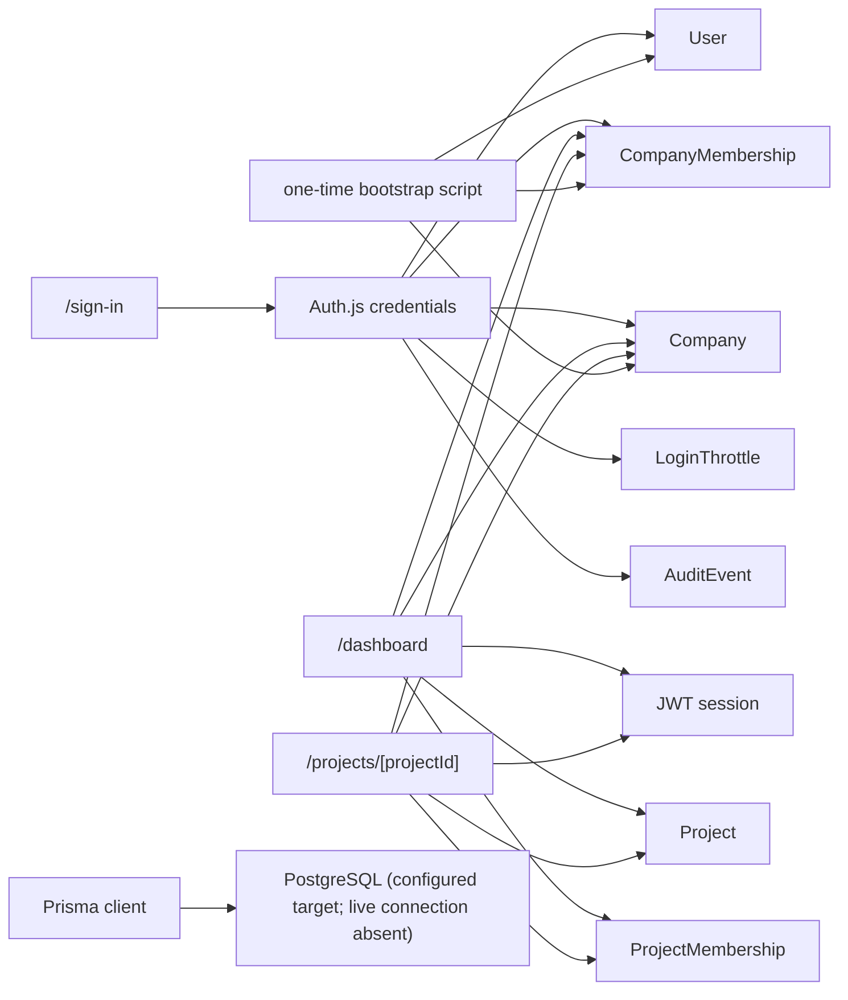

# Module dependency map

## Observed data and service dependencies

## Known coupling and boundaries

- Pages call Prisma-backed authorization/data access directly from server components. There is no separate domain service/API layer yet.
- Authentication is coupled to `User`, active `CompanyMembership`, active `Company`, `LoginThrottle`, and `AuditEvent`.
- `Project` belongs to one `Company`; project membership links a user and project. Membership FKs use restrict-on-delete; audit actor uses set-null.
- `CompanyRole` is used for project-list breadth. `ProjectRole` is recorded but does not currently vary individual project-page privileges.
- No cross-module table access, module event, trigger, stored procedure, outbox, circular dependency, or hidden integration was located in declared sources.
- The actual database was unavailable, so deployment-only triggers/extensions/direct SQL consumers cannot be ruled out.

## Dependencies not present

No delivered Parts 03/04/06/07/09/10/11/12/13/14/19/35 engines or interfaces were found. Existing foundation adapters are: local membership checks for authorization and a single `AuditEvent` writer for auth audit. These are not substitutes for the shared engines and must not be advertised as such.
