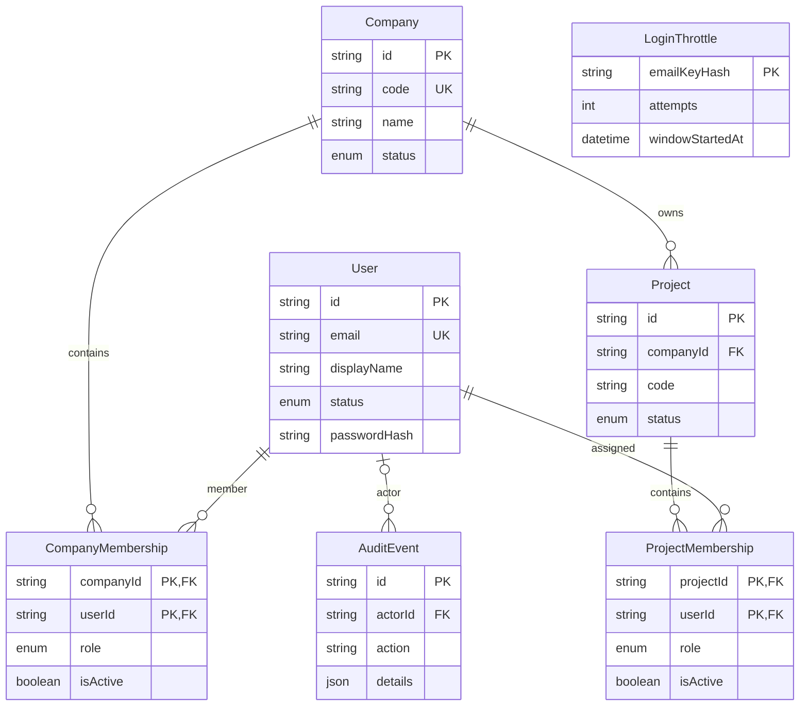

# Existing system map — Buildwise foundation

**Evidence status:** provisional source inventory, not a production/system-wide audit. Audited 2026-10-08. The app repository has no Git metadata; the inspected files are the workspace snapshot.

## Stack and versions

| Concern | Observed |
|---|---|
| Frontend / application server | Next.js 16.4.0 App Router, React 19.3.0, TypeScript 5.x |
| Backend | Next.js server components and route handler; no separate backend service |
| Database / ORM | PostgreSQL 16 target; Prisma 6.19.3 client/CLI |
| Real-time, queue, cache | None located |
| File storage / mobile | None located; no mobile app or PWA manifest/build |
| Authentication | Auth.js / NextAuth credentials provider, bcrypt password hashes, JWT session with eight-hour max age |
| Tests and quality | `npm test` (Node test runner through `tsx`), `npm run lint`, `npm run typecheck`, `npm run build`; no coverage, integration runner, CI workflow, or ERP regression command found |
| Runtime | Node.js 24.21.0 / npm 11.19.0 during this audit; declared Next.js engine support requires Node 20.9+ |
| Deployment | No hosting configuration, environment inventory, CI/CD, IaC, or production deployment workflow found. `docker-compose.yml` describes only a local Postgres service; Docker is unavailable in the audit host. |

## Repository structure

- `src/app/`: root redirect, sign-in page, protected dashboard/project pages, auth handler, global layout/theme.
- `src/components/`: sign-in form, workspace shell, sign-out button.
- `src/lib/`: Prisma client, access-policy predicate, server authorization, Auth.js options.
- `src/types/`: NextAuth session type augmentation.
- `prisma/`: seven declared models and one initial migration.
- `scripts/`: guarded initial administrator/company bootstrap.
- `tests/`: access-policy unit tests.
- `public/`: scaffold static assets.
- `docs/`: ERP program audit records created by this Part. No preceding program docs were present.

## Environments and deployment

`.env.example` documents local `DATABASE_URL`, Postgres compose variables, `AUTH_SECRET`, `NEXTAUTH_URL`, and one-time bootstrap values. No real `.env`, production secrets/configuration, migration deployment record, backup, restore evidence, environment list, or CI workflow is present. The initial migration is checked into the workspace; whether it was applied to any database is unverified.

## Authentication and authorization

- Credentials are normalized to lowercase and validated; bcrypt compares hashes. A dummy bcrypt hash is used for absent users. A SQL upsert tracks per-email HMAC attempt windows in `LoginThrottle`; success clears the throttle and writes an auth audit event.
- Session: JWT, maximum age eight hours. JWT callback checks that the user remains active.
- MFA, SSO, account recovery, user invitation, password change/rotation workflow, administrator UI, edge/IP throttling, and device/session management are not implemented.
- Workspace pages require an authenticated user. Company context is resolved against the current user’s active company membership. Company admins/super admins can list all non-archived company projects; a member needs active project membership. Individual project reads repeat company/project membership checks. See `src/lib/authorization.ts`.
- There is no fine-grained permission registry or unified authorization middleware for jobs/events/other business APIs. There are no such business APIs/jobs/events to inventory.
- Live database assertions, route authorization integration tests, and cross-tenant tests could not run without PostgreSQL.

## Modules and current state

| Module | Routes/screens | Declared data | Assessment |
|---|---|---|---|
| Identity foundation | `/sign-in`, Auth.js `/api/auth/*` | User, CompanyMembership, LoginThrottle, AuditEvent | Implemented in source; login persistence not runtime-verified |
| Company/project workspace | `/dashboard`, `/projects/[projectId]` | Company, Project, both memberships | Implemented in source; requires configured DB and bootstrap; no CRUD/user admin |
| Finance, procurement, inventory, HR/payroll, execution, quality, safety, document control, reporting | None found | None found | Not implemented |

## Workflows, calculations, reports, documents, and communication

No workflow/approval, maker-checker, posting, inventory transaction, calculation engine, business report/export, print template, document storage, notification channel, email/SMS provider, or business integration was found. Authentication audit events are the only observed audit-like writes. Details: [CALCULATION_REGISTRY.md](CALCULATION_REGISTRY.md), [ITEM_LIKE_MASTERS.md](ITEM_LIKE_MASTERS.md).

## Real-time and scheduled work

No Socket.IO or other WebSocket server, namespace, room/event catalogue, job queue, worker, cron schedule, or background service was located.

## Operations and security evidence

- No structured application logger, tracing/correlation ID middleware, telemetry exporter, alert rules, or operational dashboard located.
- `.env.example` contains placeholders only; no real credentials were found in the source files reviewed.
- Dependency audit at the preceding implementation checkpoint reported zero vulnerabilities after dependency updates; rerun audit against the current lockfile before release.
- No production schema, data, backup, recovery drill, security review report, or performance benchmark was available.
- Full findings/blockers: [RISK_REGISTER.md](RISK_REGISTER.md), [CONTROL_INVENTORY.md](CONTROL_INVENTORY.md), [DECISIONS.md](DECISIONS.md).

## Database ERD (declared schema only)

Model/column detail is in [DB_ENTITY_MAP.csv](DB_ENTITY_MAP.csv). This diagram is generated from `prisma/schema.prisma`; it is **not** a live-database ERD. Live object inventory, triggers, extension objects, and deployed row counts remain unknown until a read-only database connection is supplied.
